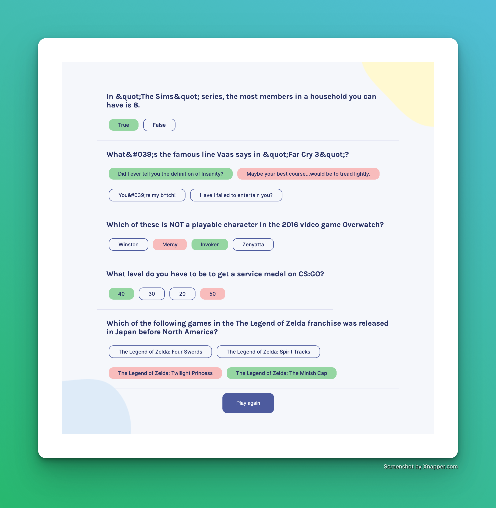

# Quizzical

This is a quiz game built using React. Users can test their knowledge by answering trivia questions from various categories.

## Technologies and Libraries Used

- React
- nanoid
- Fetch API

## Game Play

1. When the game starts, the user is presented with a start screen.
2. Upon clicking the "Start" button, the game fetches 5 trivia questions from the Open Trivia API.
3. The questions are displayed one at a time, with the possible answers randomized each time.
4. The user selects an answer by clicking on it.
5. After all questions have been answered, the user can click the "Check Answers" button to see which answers were correct and which were wrong.
6. The user can then start the game again by clicking the "Start again" button.

## Running the App

To play the game, follow this [Quizzical](https://hathon-quizzical.netlify.app/).

## Setup Instructions

1. Clone the repository to your local machine.
2. In the project directory, run `npm install` to install dependencies.
3. Run `npm run dev` to start the app in development mode.

Note: A stable internet connection is required to play the game, as it fetches data from an external API.
